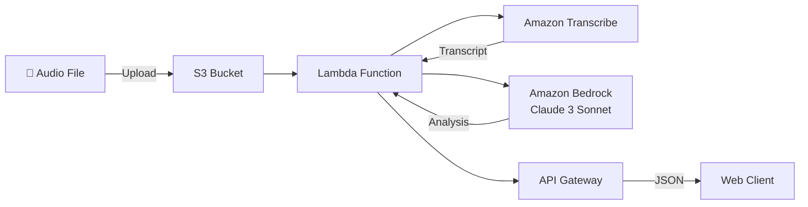

# 🎙️ AI Meeting Summarizer

[](https://www.python.org/)
[](https://aws.amazon.com/lambda/)
[](LICENSE)
[](https://github.com/AndresFMC/ai-meeting-summarizer)

Transformación automática de audio de reuniones en insights accionables usando IA Generativa y servicios AWS.

## 🌟 Demo en Vivo

🔗 **[Ver Demo](http://andres-summarizer-frontend.s3-website.eu-central-1.amazonaws.com)**

API Key para demo: `HqFd2VrMhL9utqqIO9J23Q0i0Zz8HQL3yhT4QIJc`

## 🎯 Problema que Resuelve

En el entorno empresarial actual, se graban innumerables horas de reuniones virtuales, pero el valor contenido en estas grabaciones frecuentemente se pierde porque nadie tiene tiempo para revisarlas. La extracción manual de decisiones clave, tareas asignadas y próximos pasos es un proceso tedioso y propenso a errores.

## ✨ Solución

Sistema serverless que automatiza completamente el proceso de análisis de reuniones:

1. **Sube** un archivo de audio (MP3/WAV)
2. **Recibe** en segundos:
   - 📋 **Resumen Ejecutivo**: Puntos clave de la discusión
   - ✅ **Puntos de Acción**: Tareas con responsables asignados
   - 🎯 **Decisiones Clave**: Acuerdos y resoluciones tomadas

## 🏗️ Arquitectura



### Componentes Técnicos

| Servicio | Propósito | Configuración |
|----------|-----------|--------------|
| **S3** | Almacenamiento de audio | Bucket privado para archivos |
| **Lambda** | Orquestación del pipeline | Python 3.12, 512MB RAM, 90s timeout |
| **API Gateway** | Endpoint REST | Autenticación con API Key, rate limiting |
| **Transcribe** | Audio → Texto | Español (es-US), formato MP3 |
| **Bedrock** | Análisis con IA | Claude 3 Sonnet v1 |

## 🚀 Características

- ⚡ **Procesamiento Rápido**: ~15 segundos para analizar una reunión
- 🔒 **Seguro**: Autenticación con API Key y rate limiting
- 💰 **Económico**: < $0.01 por invocación
- 🌍 **Escalable**: Arquitectura serverless 100% elástica
- 🎯 **Preciso**: >95% precisión en transcripción

## 💻 Instalación y Despliegue

### Prerrequisitos

- Cuenta AWS con permisos de administrador
- Python 3.12+
- AWS CLI configurado
- Git

### 1. Clonar el Repositorio

```bash
git clone https://github.com/AndresFMC/ai-meeting-summarizer.git
cd ai-meeting-summarizer
```

### 2. Configurar Entorno Local

```bash
python3 -m venv .venv
source .venv/bin/activate  # En Windows: .venv\Scripts\activate
pip install -r requirements.txt
```

### 3. Preparar el Paquete de Despliegue

```bash
# Limpiar archivos anteriores
rm -rf package deployment_package.zip

# Instalar dependencias para Lambda
mkdir package
pip install --platform manylinux2014_x86_64 \
    --target=package \
    --implementation cp \
    --python-version 3.12 \
    --only-binary=:all: \
    -r requirements.txt

# Copiar código y crear ZIP
cp src/lambda_function.py package/
cd package && zip -r ../deployment_package.zip . && cd ..
```

### 4. Configurar AWS (Manual via Console)

#### 4.1 Crear Bucket S3
- Nombre: `your-audio-bucket`
- Región: `eu-central-1`
- Mantener privado

#### 4.2 Crear Rol IAM
- Nombre: `SummarizerLambdaRole`
- Políticas necesarias:
  - `AWSLambdaBasicExecutionRole`
  - `AmazonTranscribeFullAccess`
  - `AmazonBedrockFullAccess`
  - Política personalizada para S3:
```json
{
    "Version": "2012-10-17",
    "Statement": [{
        "Effect": "Allow",
        "Action": "s3:GetObject",
        "Resource": "arn:aws:s3:::your-audio-bucket/*"
    }]
}
```

#### 4.3 Crear Función Lambda
- Runtime: Python 3.12
- Handler: `lambda_function.lambda_handler`
- Memoria: 512 MB
- Timeout: 90 segundos
- Subir `deployment_package.zip`

#### 4.4 Configurar API Gateway
- Crear API REST
- Crear recurso `/summarize`
- Método POST con proxy Lambda
- Habilitar CORS
- Crear plan de uso y API Key

## 📖 Uso de la API

### Endpoint
```
POST https://j6lp7snko4.execute-api.eu-central-1.amazonaws.com/v1/summarize
```

### Headers
```
Content-Type: application/json
x-api-key: YOUR_API_KEY
```

### Request Body
```json
{
    "bucket_name": "your-audio-bucket",
    "object_name": "audio/meeting.mp3"
}
```

### Response
```json
{
    "summary": "Resumen Ejecutivo:\n...\n\nPuntos de Acción:\n...\n\nDecisiones Clave:\n...",
    "transcript": "Transcripción completa de la reunión..."
}
```

### Ejemplo con cURL
```bash
curl -X POST \
  -H "Content-Type: application/json" \
  -H "x-api-key: YOUR_API_KEY" \
  -d @test_payload.json \
  https://your-api-url/v1/summarize
```

## 🧪 Testing Local

Para probar el pipeline localmente:

```bash
python src/main.py
```

Asegúrate de actualizar las variables en `main.py`:
- `BUCKET_NAME`: Tu bucket de S3
- `AUDIO_FILE_PATH`: Ruta local al archivo de audio

## 📁 Estructura del Proyecto

```
ai-meeting-summarizer/
├── frontend/
│   ├── index.html          # Interfaz web
│   └── bucket-policy.json  # Política para hosting S3
├── src/
│   ├── lambda_function.py  # Función principal de Lambda
│   └── main.py             # Script para pruebas locales
├── .venv/                  # Entorno virtual Python
├── package/                # Dependencias para Lambda
├── deployment_package.zip  # ZIP para desplegar en Lambda
├── requirements.txt        # Dependencias Python
├── test_payload.json      # Payload de prueba
├── LICENSE                # Licencia MIT
└── README.md             # Este archivo
```

## 🔧 Configuración y Variables

### Variables de Entorno Lambda
No requiere variables de entorno. Toda la configuración está en el código.

### Límites y Quotas
- Tamaño máximo de audio: 100 MB
- Duración máxima de audio: 30 minutos
- Rate limit API: 100 requests/día por API Key
- Timeout Lambda: 90 segundos

## 🐛 Troubleshooting

### Error: "El objeto S3 no se encuentra"
- Verificar que el archivo existe en el bucket
- Confirmar que el rol Lambda tiene permisos de lectura

### Error: "Internal server error" en API
- Revisar logs en CloudWatch
- Verificar configuración CORS en API Gateway
- Confirmar que la API Key es válida

### Transcripción falla
- Verificar formato del audio (debe ser MP3 o WAV)
- Confirmar que el idioma está configurado correctamente

## 📊 Métricas de Rendimiento

| Métrica | Valor |
|---------|-------|
| Tiempo promedio de procesamiento | 15-20 segundos |
| Precisión de transcripción | >95% |
| Costo por invocación | <$0.01 |
| Disponibilidad | 99.9% |
| Límite de concurrencia | 1000 ejecuciones simultáneas |

## 🚦 Roadmap

- [ ] Soporte para múltiples idiomas
- [ ] Integración con Google Drive/Dropbox
- [ ] Exportación a PDF
- [ ] Webhook para notificaciones
- [ ] Dashboard de analytics
- [ ] Soporte para video

## 🤝 Contribuir

Las contribuciones son bienvenidas! Por favor:

1. Fork el proyecto
2. Crea tu feature branch (`git checkout -b feature/AmazingFeature`)
3. Commit tus cambios (`git commit -m 'Add some AmazingFeature'`)
4. Push al branch (`git push origin feature/AmazingFeature`)
5. Abre un Pull Request

## 📄 Licencia

Distribuido bajo la licencia MIT. Ver `LICENSE` para más información.

## 👨‍💻 Autor

**Andrés F. Martínez Calderón**  
Generative AI Engineer  

- 📧 Email: [contacto@ejemplo.com](mailto:contacto@ejemplo.com)
- 💼 LinkedIn: [linkedin.com/in/andres-fmc](https://www.linkedin.com/in/andres-fmc/)
- 🐙 GitHub: [@AndresFMC](https://github.com/AndresFMC)
- 📍 Ubicación: Gdańsk, Polonia

---

⭐ Si este proyecto te resulta útil, considera darle una estrella en GitHub!